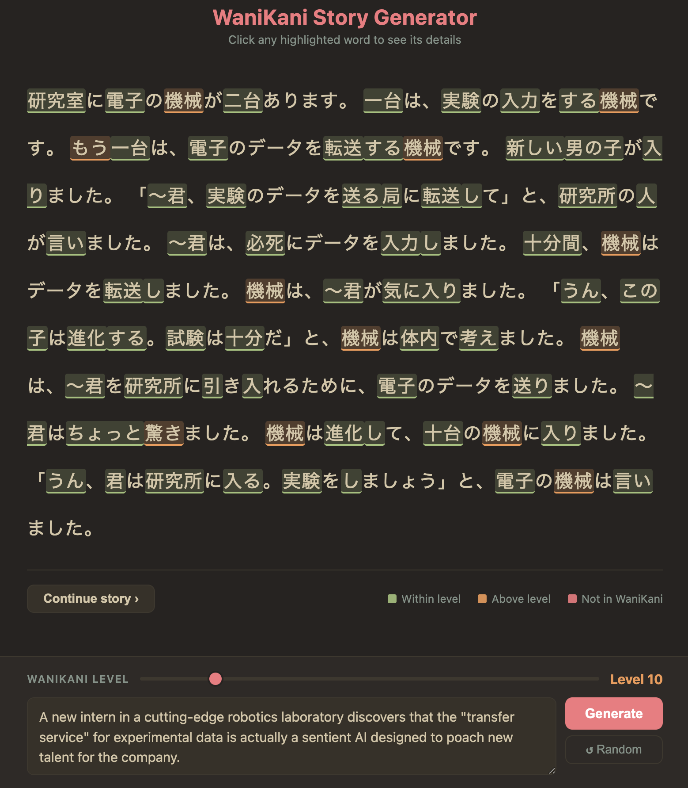

# wk-reader

A Japanese reading practice tool for [WaniKani](https://www.wanikani.com) learners. Enter a story prompt (or generate a random one), pick your WaniKani level, and get a short Japanese story using only vocabulary you've already learned.

Every content word in the story comes from your known WaniKani vocabulary. Click any highlighted word to see its reading, meaning, and level.



---

## How it works

1. Your prompt is embedded and used to retrieve the most semantically relevant words from your known vocabulary
2. A brief prompt expansion grounds the retrieval in concrete scene detail
3. Gemini generates a 10–15 sentence story constrained strictly to the retrieved word list
4. The story is tokenised with kuromoji and annotated client-side:
   - 🟢 **Green** — word is within your level
   - 🟠 **Orange** — word is in WaniKani but above your level
   - 🔴 **Red** — kanji not in WaniKani at all

---

## Setup

### Requirements

- Node.js 22+
- An OpenAI-compatible API key with access to `text-embedding-3-small`, `gemini-2.5-flash`, and `gemini-3.5-flash` (`AI_API_KEY`)
- The pre-built embedding files (see below)

### Install

```bash
git clone git@github.com:terakael/wk-reader.git
cd wk-reader
npm install
```

### Configure

Copy the example config and fill in your values:

```bash
cp config.example.json config.json
```

Edit `config.json` with your API endpoints and keys. Each `apiKey` field also accepts an `apiKeyCmd` sibling — a shell command whose stdout is used as the key:

```json
"apiKeyCmd": "security find-generic-password -a api-keys -s openai -w"
```

### Embedding files

The vocab embeddings (~41 MB) are not included in the repo. Download and place them in the project root:

- `vocab_embeddings.bin`
- `vocab_embeddings_index.json`

> **Alternatively**, rebuild them yourself (requires `AI_API_KEY`, costs ~$0.02 in embedding tokens):
> ```bash
> AI_API_KEY=your_key node scripts/embed-vocab.js
> ```

### Run

```bash
node server.js
```

Open [http://localhost:3000](http://localhost:3000).

---

## Tech

- **Backend:** Node.js, Express 5, kuromoji (Japanese tokeniser)
- **Frontend:** Vanilla JS, single HTML file
- **Embeddings:** `text-embedding-3-small` via OpenAI-compatible API
- **Prompt enhancement:** `gemini-2.5-flash` (no thinking)
- **Story generation:** `gemini-3.5-flash`, streaming SSE (no thinking)
- **Annotation:** greedy longest-match merge over kuromoji tokens → WaniKani vocab lookup
